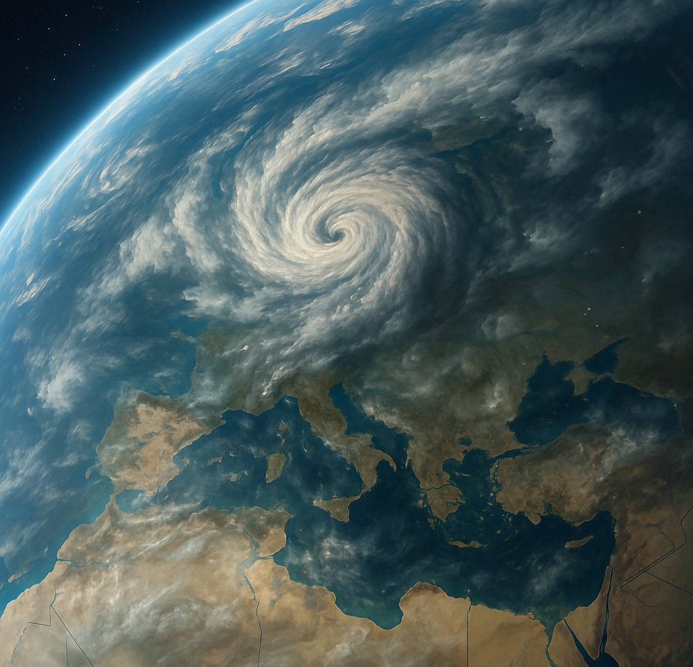

<div align="center">
<h1> DeMeTra </h1>
<br>

<h3> Medicanes detection and tracking </h3>
</div>


## Environment setup

Create a Python 3.9 Conda environment and install the repo dependencies:

```bash
conda create -n demetra python=3.9 -y
conda activate demetra

python -m pip install --upgrade pip
python -m pip install -r requirements.txt
```


Note: the file currently pins `torch==1.12.1+cu113`, `torchvision==0.13.1+cu113`
and `torchaudio==0.12.1+cu113`. If your machine does not use CUDA 11.3, adjust
those lines before installing.

## Quick start
Launch the following script to download image data from Eumetsat (using your account keys) and track with DeMeTra

```bash
export EUMETSAT_CONSUMER_KEY=<your_consumer_key>
export EUMETSAT_CONSUMER_SECRET=<your_consumer_secret>

conda activate demetra

python scripts/download_and_track_range.py   --start 15-03-2026   --end 17-03-2026 \ 
  --firstpass_model_path <firstpass_model_checkpoint> \
  --tracking_model_path <videomae_model_checkpoint>
```

the script will automatically download data from EUMETSAT using your account keys


## Example using most common features

```bash
python scripts/predict_firstpass_and_track_from_folder.py   \
--input_dir /media/isacDisk2/source_dataset_by_cyc/jolina  \
--output_dir /media/isacDisk2/demetra_output/jolina  \
--firstpass_model_path /media/isacDisk1/Demetra/trained_models/firstpass_model.ckpt \
--tracking_model_path /media/isacDisk2/demetra_trained_models/checkpoint_new_tracking2.pth \
--firstpass_threshold 0.2 \
--make_video \
--ffmpeg_path /mnt/share/Demetra_files/VideoMAEv2/ffmpeg-7.0.2-amd64-static/ \
--standard_tiling \
--video_coastlines \
--video_tracking_dot_only 
```