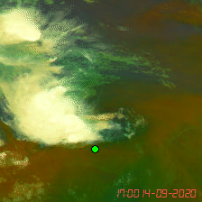
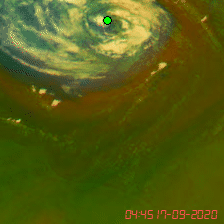
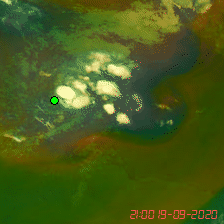

# Supplementary Material: Ianos and MANOS Track–Image Consistency

## Purpose

The following Airmass RGB video tiles illustrate the temporal consistency between the cyclone-center positions derived from the MANOS track and the cloud structures visible in satellite imagery during Medicane Ianos (September 2020).

Each animation contains 16 consecutive 224 × 224 pixel frames at 5-minute cadence. The bright-green marker indicates the MANOS cyclone center; its position at intermediate timestamps is obtained by linear interpolation between the hourly MANOS coordinates. Timestamps are reported in UTC.

## 14 September 2020, around 18:00 UTC

**Displayed interval:** 17:00–18:15 UTC.

In this early-stage example, the clouds around the MANOS center do not exhibit an unambiguous, coherent rotational motion. The tracked center lies close to an active cloud system, but the animation provides limited visual evidence of a well-organized cyclonic circulation at that position.

## 17 September 2020, ending at 06:00 UTC

**Displayed interval:** 04:45–06:00 UTC.

This sequence corresponds to the central, mature phase of Ianos. In contrast to the other examples, the satellite imagery shows a clear and coherent rotating cloud structure around the MANOS center. The agreement between the track position and the visually identifiable circulation is substantially stronger.

## 19 September 2020, around 22:00 UTC

**Displayed interval:** 21:00–22:15 UTC.

In this late-stage example, the cloud field near the MANOS center is fragmented and does not show a clear, persistent cyclonic rotation. As on 14 September, the tracked position and the most evident organization in the satellite cloud pattern are not fully aligned.

## Interpretation

Together, these video tiles demonstrate that a MANOS track coordinate does not always coincide with a clearly observable rotating cloud structure in Airmass RGB imagery. The mismatch is particularly evident in the selected sequences from 14 and 19 September, whereas the 17 September sequence shows strong track–image agreement during the mature phase of Ianos.

These examples support careful temporal curation of supervised tracking data. Track coordinates remain physically meaningful metadata, but outside the mature phase they may provide weak or visually ambiguous supervision when used as direct labels for satellite-image models. The absence of a clear cloud rotation in an Airmass RGB tile should not, by itself, be interpreted as proof that no dynamical circulation was present; it indicates that the circulation is not unambiguously expressed by the selected satellite composite and spatial window.
